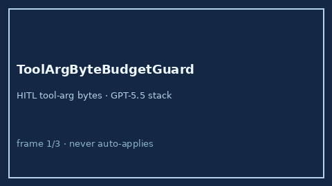

# ToolArgByteBudgetGuard Guide



Offline HITL guard. Caps serialized tool-argument bytes. Never performs network
I/O. Closes unbounded tool-arg payload gaps vs AutoGen / CrewAI / LangGraph.

Optional later polish via **GPT-5.5 / Claude Sonnet 4.6 / Gemini 3.x / Kimi K2**.

Distinct from `ToolResultTruncator` and `ToolArgumentSanitizer`.

## Usage

```python
from multi_bot_agentic.tool_arg_byte_budget import ToolArgByteBudgetGuard

status = ToolArgByteBudgetGuard().check(
    "search",
    {"query": "multi-bot"},
    max_bytes=2048,
)
assert status.requires_human_review is True
print(status.band, status.arg_bytes)
```

## Safety

Always `requires_human_review=True`. No HTTP. Humans decide. See `SAFETY.md`.
