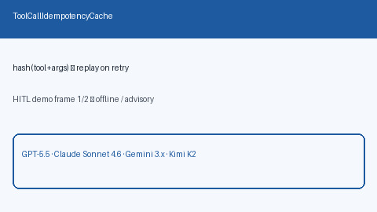

# Tool Call Idempotency Cache Guide



Cache tool results by a stable hash of tool name + canonical args so retries
can replay without re-executing.

Works with **GPT-5.5 / Claude Sonnet 4.6 / Gemini 3.x / Kimi K2** tool loops.

Distinct from:

- `DeadLetterToolQueue` — post-exhaustion **HITL** dead letters
- `ToolResultTruncator` — oversized tool payload **size** capping

This module is a **retry-safe idempotency** cache for identical tool calls.

## Gap vs AutoGen / CrewAI / LangGraph

| Capability | multi-bot-agentic | AutoGen / CrewAI / LangGraph |
| --- | --- | --- |
| Focus | Hash-keyed tool result replay | Often re-run identical tool calls |
| API | `put` / `get` / `invalidate` | Framework-dependent |
| Wiring | Caller-driven, no network | Often no local idempotency map |

## Usage

```python
from multi_bot_agentic.tool_idempotency_cache import ToolCallIdempotencyCache

cache = ToolCallIdempotencyCache()
cache.put("search", {"q": "docs"}, "hit:docs")
assert cache.get("search", {"q": "docs"}).result == "hit:docs"
cache.invalidate("search", {"q": "docs"})
assert cache.get("search", {"q": "docs"}) is None
```
