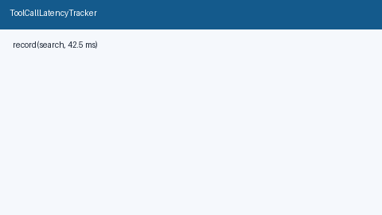

# Tool Call Latency Tracker Guide



Record per-tool latency samples and read advisory **p50 / p95** percentiles.
Never kills or blocks tools — callers decide how to react to slow calls.

Works with **GPT-5.5 / Claude Sonnet 4.6 / Gemini 3.x / Kimi K2** multi-bot
tool loops.

Distinct from:

- `RunDeadlineWatchdog` — wall-clock remaining/expired advisory for a whole run
- `AdaptiveConcurrencyLimiter` — global in-flight tool concurrency caps

## Gap vs AutoGen / CrewAI / LangGraph

| Capability | multi-bot-agentic | AutoGen / CrewAI / LangGraph |
| --- | --- | --- |
| Focus | Local per-tool p50/p95 latency store | Often tracing-backend only |
| API | `record` / `stats` / `reset` | Framework-dependent |
| Wiring | Caller-driven, never kills tools | Often coupled to runners |

## Usage

```python
from multi_bot_agentic.tool_latency import ToolCallLatencyTracker

tracker = ToolCallLatencyTracker(max_samples_per_tool=256)
tracker.record("search", 42.5)
stats = tracker.stats("search")
assert stats.p50_ms is not None
tracker.reset("search")
```
