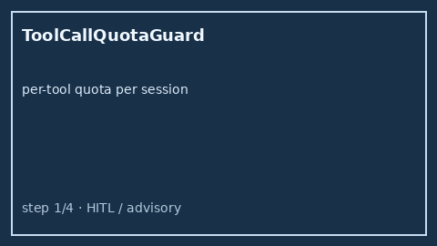

# Tool Call Quota Guard Guide



Cap how many times each tool may be called per `session_id` with **advisory**
(status only) or **hard** (raises when exhausted) modes. Never performs
network I/O.

Works with **GPT-5.5 / Claude Sonnet 4.6 / Gemini 3.x / Kimi K2** multi-bot chats.

Distinct from:

- `ToolPermissionAllowlist` — per-bot ACL allow/deny (who may call a tool)
- `ToolCallLatencyTracker` — per-tool latency samples (p50/p95 advisory)
- `RateLimitedToolRunner` — sliding wall-clock window rate limit

## Gap vs AutoGen / CrewAI / LangGraph / Semantic Kernel

| Capability | multi-bot-agentic | AutoGen / CrewAI / LangGraph / Semantic Kernel |
| --- | --- | --- |
| Focus | Per-session per-tool call quota + advisory/hard | Often time-window or global only |
| API | `check` / `record` / `reset` | Framework-dependent |
| Wiring | Caller-driven, no network | Often middleware / plugins |

## Usage

```python
from multi_bot_agentic.tool_call_quota import ToolCallQuotaGuard

guard = ToolCallQuotaGuard(max_calls=3, mode="hard")
status = guard.check("sess-1", "search")
assert status.allowed is True
guard.record("sess-1", "search")
guard.reset("sess-1", "search")
```
