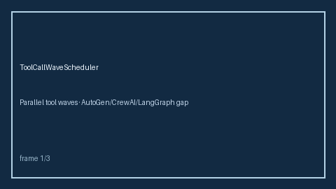

# Tool Call Wave Scheduler Guide



Partition tool calls into dependency-depth waves so independent tools can run
in parallel within a wave. Never performs network I/O. Closes the AutoGen /
CrewAI / LangGraph explicit tool-wave scheduler gap.

Optional later polish via **GPT-5.5 / Claude Sonnet 4.6 / Gemini 3.x / Kimi K2**.

Distinct from `FanInBarrierGate` and `AdaptiveConcurrencyLimiter`.

## Usage

```python
from multi_bot_agentic.tool_call_wave import ToolCallWaveScheduler

plan = ToolCallWaveScheduler().plan({"fetch": [], "parse": ["fetch"], "summarize": ["parse"]})
assert plan.waves == (("fetch",), ("parse",), ("summarize",))
```

## Safety

Offline only. Hard mode raises on cycles/unknown deps; advisory dumps unresolved
nodes into a final best-effort wave.
