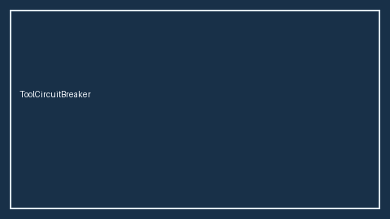

# Tool Circuit Breaker Guide



Per-tool failure isolation with classic **closed → open → half-open** states.
Distinct from LangGraph retry policies and CrewAI crew-level failure handling.

Works with **GPT-5.5 / Claude Sonnet 4.6 / Gemini 3.x / Kimi K2** tool loops.

## Gap vs LangGraph / CrewAI

| Capability | multi-bot-agentic | LangGraph / CrewAI |
| --- | --- | --- |
| Scope | Per-tool circuit | Graph/crew-level retries |
| States | closed / open / half-open | Framework-specific |
| Wiring | Caller-driven guard | Often framework-integrated |

## Usage

```python
from multi_bot_agentic.circuit_breaker import ToolCircuitBreaker, CircuitOpenError

breaker = ToolCircuitBreaker(failure_threshold=3, cooldown_seconds=30.0)
try:
    breaker.allow("checklist")
except CircuitOpenError as exc:
    print(exc.details.retry_after_seconds)
else:
    # invoke tool, then:
    breaker.record_success("checklist")
    # or breaker.record_failure("checklist")
```
