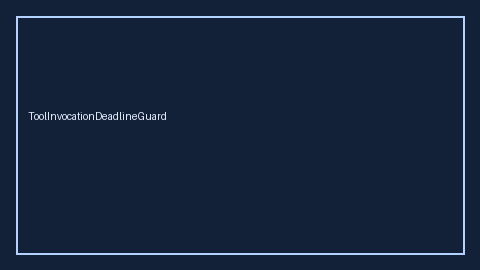

# ToolInvocationDeadlineGuard Guide



Closes AutoGen / CrewAI / LangGraph per-tool invocation deadlines gaps.

Optional later polish via **GPT-5.5 / Claude Sonnet 4.6 / Gemini 3.x / Kimi K2**.

Distinct from `ToolCallLatencyTracker` and `RunDeadlineWatchdog`.

## Usage

```python
from multi_bot_agentic.tool_invocation_deadline import ToolInvocationDeadlineGuard

status = ToolInvocationDeadlineGuard().check("session-1", tool_name="search", elapsed_s=1.0, deadline_s=10.0)
assert status.requires_human_review is True
print(status.band)
```

## Safety

Always `requires_human_review=True`. No HTTP. Humans decide.
