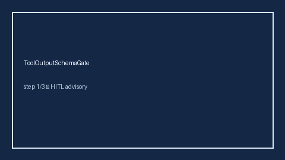

        # ToolOutputSchemaGate Guide

        

        Offline HITL control. Never performs network I/O.

        Optional polish via **GPT-5.5 / Claude Sonnet 4.6 / Gemini 3.x / Kimi K2**.

        ## Usage

        ```python
from multi_bot_agentic.tool_output_schema_gate import ToolOutputSchemaGate

verdict = ToolOutputSchemaGate().check(
    "web_search",
    {"query": "agents", "hits": []},
    required_keys=("query", "hits"),
)
assert verdict.requires_human_review is True
print(verdict.band)
```


        ## Safety

        Always `requires_human_review=True`. Humans decide. See `SAFETY.md`.
