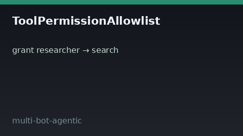

# Tool Permission Allowlist Guide



Per-bot tool ACL gate: grant/revoke tools by `bot_id`, then `check` before
execute. Default-deny so bots only call what they were explicitly allowed.

Works with **GPT-5.5 / Claude Sonnet 4.6 / Gemini 3.x / Kimi K2** multi-bot crews.

Distinct from:

- Global `SafetyPolicy` tool allowlist — run-wide, not per-bot
- `HitlApprovalGate` — human file-backed approval for sensitive tools

## Gap vs AutoGen / CrewAI / LangGraph

| Capability | multi-bot-agentic | AutoGen / CrewAI / LangGraph |
| --- | --- | --- |
| Focus | Per-bot tool allow/deny ACL | Often one shared tool set |
| API | `grant` / `revoke` / `check` | Framework-dependent |
| Wiring | Caller-driven, no network | Often crew/graph config only |

## Usage

```python
from multi_bot_agentic.tool_permission import (
    ToolPermissionAllowlist,
    ToolPermissionDecision,
)

acl = ToolPermissionAllowlist()
acl.grant("researcher", "search")
assert acl.check("researcher", "search").decision is ToolPermissionDecision.ALLOWED
assert acl.check("researcher", "shell").decision is ToolPermissionDecision.DENIED
acl.revoke("researcher", "search")
```
