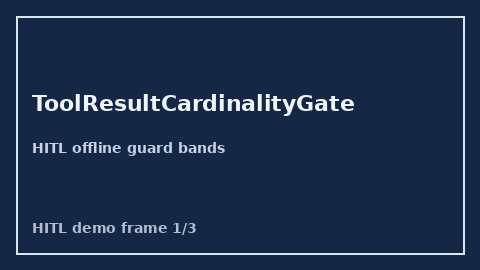

        # ToolResultCardinalityGate Guide

        

        Closes AutoGen / CrewAI / LangGraph tool-result cardinality gates gaps.

        Optional later polish via **GPT-5.5 / Claude Sonnet 4.6 / Gemini 3.x / Kimi K2**.

        Distinct from `ToolResultSchemaHashGate` and `ToolResultFingerprintDeduper`.

        ## Usage

        ```python
        from multi_bot_agentic.tool_result_cardinality import ToolResultCardinalityGate

status = ToolResultCardinalityGate().check(
    "session-1", tool_name="search", item_count=250
)
assert status.requires_human_review is True
print(status.band)
        ```

        ## Safety

        Always `requires_human_review=True`. No HTTP. Humans decide.
