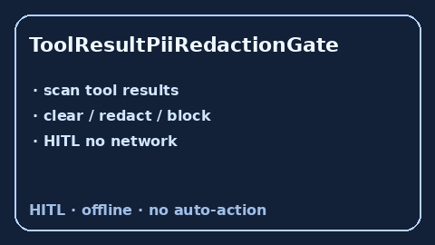

# ToolResultPiiRedactionGate Guide



Offline HITL gate. Flags tool-result PII before re-entry. Closes gaps vs
AutoGen / CrewAI / LangGraph tool-result PII controls.

Optional later polish via **GPT-5.5 / Claude Sonnet 4.6 / Gemini 3.x / Kimi K2**.

Distinct from `ObservationRedactor` and `RedactionTool`.

## Usage

```python
from multi_bot_agentic.tool_result_pii_gate import ToolResultPiiRedactionGate

status = ToolResultPiiRedactionGate().check("fetch", result_text="email a@b.co ssn 123-45-6789")
assert status.requires_human_review is True
print(status.band, status.matched_kinds)
```

## Safety

Always `requires_human_review=True`. No HTTP. Humans decide. See `SAFETY.md`.
