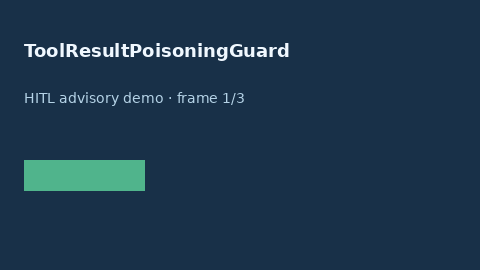

# ToolResultPoisoningGuard Guide



Offline HITL guard/advisor. Never network I/O. Gap vs AutoGen/CrewAI/LangGraph tool-result poisoning guards.

Distinct from `ToolResultPiiGate` / `ToolResultSchemaHashGate`.

Optional polish via **GPT-5.5 / Claude Sonnet 4.6 / Gemini 3.x / Kimi K2**.

## Usage

```python
from multi_bot_agentic.tool_result_poisoning import ToolResultPoisoningGuard

status = ToolResultPoisoningGuard().check("s1", poison_score=0.1)
assert status.requires_human_review is True
print(status.band)
```

## Safety

Always `requires_human_review=True`. Humans decide.
