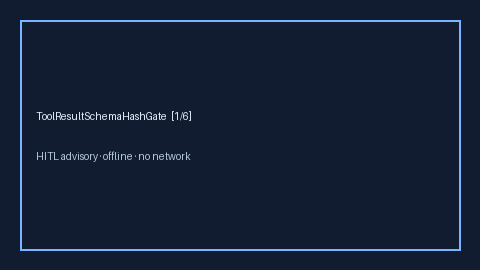

# ToolResultSchemaHashGate Guide



Offline HITL gate. Flags tool-result schema hash drift.
Closes AutoGen / CrewAI / LangGraph schema-drift gaps.

Optional polish via **GPT-5.5 / Claude Sonnet 4.6 / Gemini 3.x / Kimi K2**.

Distinct from `ToolOutputSchemaGate` and `ToolResultPiiRedactionGate`.

## Usage

```python
from multi_bot_agentic.tool_result_schema_hash import ToolResultSchemaHashGate

status = ToolResultSchemaHashGate().check("search", expected_hash="abc123", observed_hash="abc999")
assert status.requires_human_review is True
print(status.band)
```

## Safety

Always `requires_human_review=True`. No HTTP. Humans decide.
