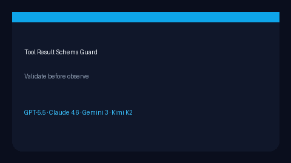

# Tool Result Schema Validator Guide



Validate `ToolResult` shape and optional metadata contracts before feeding
observations back into the decision engine.

Works with **GPT-5.5 / Claude Sonnet 4.6 / Gemini 3.x / Kimi K2** tool loops.

## Gap vs LangChain / CrewAI

| Capability | multi-bot-agentic | LangChain / CrewAI |
| --- | --- | --- |
| Focus | Post-tool result guard | Pre-call argument schemas |
| Dependencies | Stdlib only | Often pydantic-heavy |
| Failure | Issues list or ValueError | Framework exceptions |

## Usage

```python
from multi_bot_agentic.schema_validate import ToolResultSchemaValidator
from multi_bot_agentic.models import ToolResult

validator = ToolResultSchemaValidator(
    required_metadata_keys=frozenset({"request_id"}),
    metadata_value_types={"latency_ms": int},
)
result = ToolResult(tool_name="echo", ok=True, content="hi", metadata={"request_id": "r1", "latency_ms": 3})
assert validator.validate(result).ok
validator.assert_valid(result)
```
