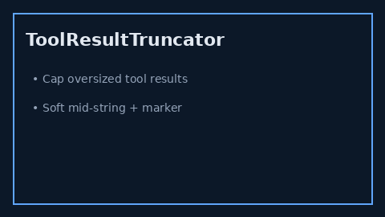

# Tool Result Truncator Guide



Bound oversized tool result strings before they inflate the LLM context.

Works with **GPT-5.5 / Claude Sonnet 4.6 / Gemini 3.x / Kimi K2** agent loops.

Distinct from the user-facing `truncate` tool (`tools/text_truncate.py`) — this
is an orchestration-layer guard, not a bot-callable text tool.

## Gap vs AutoGen / CrewAI / LangGraph

| Capability | multi-bot-agentic | AutoGen / CrewAI / LangGraph |
| --- | --- | --- |
| Focus | Soft mid-string tool-result cap | Often unbounded raw tool payloads |
| Marker | Configurable ellipsis mid-string | Framework-dependent |
| Wiring | Caller-driven `truncate(text, max_chars=…)` | Often post-hoc / missing |

## Usage

```python
from multi_bot_agentic.tool_result_truncator import ToolResultTruncator

result = ToolResultTruncator().truncate("A" * 10_000, max_chars=200)
assert result.was_truncated
assert result.truncated_len <= 200
assert result.marker  # e.g. …[truncated]…
print(result.text)
```
