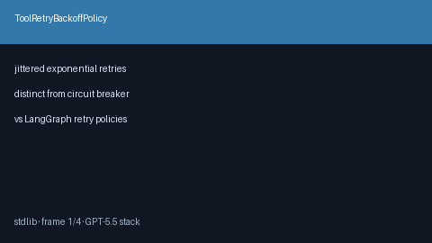

# Tool Retry Backoff Policy Guide



Jittered exponential backoff for transient tool failures. Distinct from
`ToolCircuitBreaker` (which opens after consecutive failures).

Works with **GPT-5.5 / Claude Sonnet 4.6 / Gemini 3.x / Kimi K2** tool loops.

## Gap vs LangGraph / CrewAI

| Capability | multi-bot-agentic | LangGraph / CrewAI |
| --- | --- | --- |
| Scope | Per-call retry delay | Graph/crew retry policies |
| Jitter | Full jitter optional | Framework-specific |
| Wiring | Caller-driven `next_delay` / `run` | Often framework-integrated |

## Usage

```python
from multi_bot_agentic.retry_backoff import ToolRetryBackoffPolicy

policy = ToolRetryBackoffPolicy(max_attempts=3, base_seconds=0.5, jitter=True)
decision = policy.next_delay(1)
assert decision.should_retry is True

result = policy.run(lambda: "ok")
```
