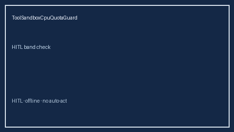

# ToolSandboxCpuQuotaGuard Guide



Closes AutoGen/CrewAI/LangGraph tool-sandbox CPU quota controls gaps.

Optional later polish via **GPT-5.5 / Claude Sonnet 4.6 / Gemini 3.x / Kimi K2**.

Distinct from `ToolSandboxEgressClassGuard` and `ToolArgByteBudgetGuard`.

## Usage

```python
from multi_bot_agentic.tool_sandbox_cpu_quota import ToolSandboxCpuQuotaGuard

status = ToolSandboxCpuQuotaGuard().check("session-1", cpu_percent=82.0)
assert status.requires_human_review is True
print(status.band)
```

## Safety

Always `requires_human_review=True`. No HTTP. Humans decide.
