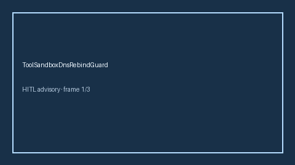

# ToolSandboxDnsRebindGuard Guide



Offline HITL guard. Never network I/O.
Gap vs AutoGen/CrewAI/LangGraph tool-sandbox DNS-rebinding guards. Distinct from `ToolSandboxNetworkExfilGuard` / `ToolSandboxEgressGuard`.

Optional polish via **GPT-5.5 / Claude Sonnet 4.6 / Gemini 3.x / Kimi K2**.

## Usage

```python
from multi_bot_agentic.tool_sandbox_dns_rebind import ToolSandboxDnsRebindGuard

status = ToolSandboxDnsRebindGuard().check("s1", rebind_score=0.35)
assert status.requires_human_review is True
print(status.band)
```

## Safety

Always HITL. Humans decide.
