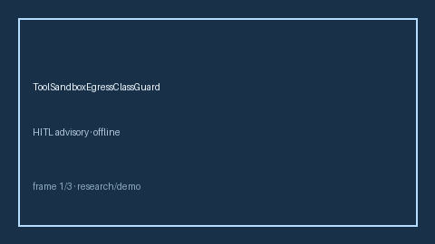

# ToolSandboxEgressClassGuard Guide



Closes AutoGen / CrewAI / LangGraph tool sandbox egress class controls gaps.

Optional later polish via **GPT-5.5 / Claude Sonnet 4.6 / Gemini 3.x / Kimi K2**.

Distinct from `ToolPermissionAllowlist` and `ToolInvocationDeadlineGuard`.

## Usage

```python
from multi_bot_agentic.tool_sandbox_egress import ToolSandboxEgressClassGuard

status = ToolSandboxEgressClassGuard(max_allowed="local").check("session-1", tool_name="fetch", egress_class="network")
assert status.requires_human_review is True
print(status.band)
```

## Safety

Always `requires_human_review=True`. No HTTP. Humans decide.
