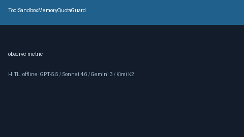

# ToolSandboxMemoryQuotaGuard Guide



Offline HITL guard/advisor. Never auto-acts. Closes closed-UI gaps vs AutoGen/CrewAI/LangGraph tool-sandbox memory quota controls.

Optional later polish via **GPT-5.5 / Claude Sonnet 4.6 / Gemini 3.x / Kimi K2**.

Distinct from `ToolSandboxCpuQuotaGuard and SharedMemoryQuotaGuard`.

## Usage

```python
from multi_bot_agentic.tool_sandbox_memory_quota import ToolSandboxMemoryQuotaGuard

status = ToolSandboxMemoryQuotaGuard().check("session-1", memory_mb=768.0)
assert status.requires_human_review is True
print(status.band)
```

## Safety

Always `requires_human_review=True`. No HTTP. Humans decide. See `docs/SAFETY.md`.
