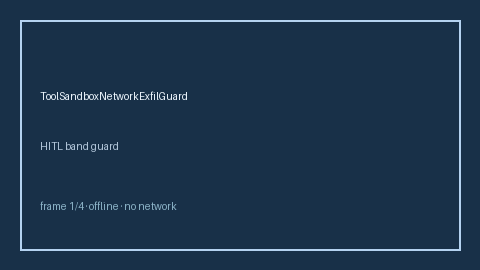

# ToolSandboxNetworkExfilGuard Guide



Offline HITL guard. Never performs network I/O.
Closes gaps vs AutoGen/CrewAI/LangGraph tool-sandbox network-exfil guards.

Optional later polish via **GPT-5.5 / Claude Sonnet 4.6 / Gemini 3.x / Kimi K2**.

Distinct from `ToolSandboxDiskQuotaGuard` / `ToolSandboxMemoryQuotaGuard`.

## Usage

```python
from multi_bot_agentic.tool_sandbox_network_exfil import ToolSandboxNetworkExfilGuard

status = ToolSandboxNetworkExfilGuard().check("session-1", exfil_score=0.35)
assert status.requires_human_review is True
print(status.band)
```

## Safety

Always `requires_human_review=True`. No HTTP. Humans decide.
