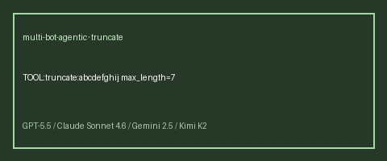

# Text Truncate Tool User Guide



## Why

Popular agent frameworks (LangGraph toolkits, OpenAI Agents SDK examples, Claude
tool-use demos) ship a dedicated **truncate/clip** helper so the model does not
invent ellipses or drop characters inconsistently. **multi-bot-agentic** now
includes the same capability as a deterministic, allowlisted tool — safe for
GPT-5.5 / Claude Sonnet 4.6 / Gemini 2.5 / Kimi K2 workers.

## Usage

Programmatic:

```python
from multi_bot_agentic.models import ToolInvocation
from multi_bot_agentic.tools.text_truncate import TextTruncateTool

result = TextTruncateTool().execute(
    ToolInvocation(
        tool_name="truncate",
        arguments={"text": "abcdefghij", "max_length": 7},
    )
)
print(result.content)  # abcd...
```

Via the decision-engine directive (sentinel embeds max length):

```text
TOOL:truncate:abcdefghij<<<TRUNCATE>>>7
```

When no max length is supplied, the default is 256 characters.

## Bounds

| Limit | Value |
|---|---|
| Max document chars | 20_000 |
| Default `max_length` | 256 |
| Max `max_length` | 20_000 |
| Max ellipsis chars | 16 |
| Default ellipsis | `...` |

Empty text, oversized input, and invalid `max_length` / `ellipsis` return
`ok=False` structured failures — never exceptions into the run loop.

## Duration case-fold note

The companion `duration` tool now uppercases designators before parsing, so
lowercase payloads like `pt1h30m` resolve to 5400 seconds the same as `PT1H30M`.

## Safety

Listed in `SafetyPolicy.allowed_tools` as `truncate`. No network, no code
execution. See `docs/SAFETY.md`.
