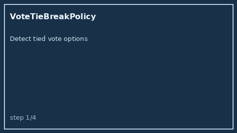

# VoteTieBreakPolicy Guide



Offline HITL tie-break for multi-bot votes. Never performs network I/O.

Optional polish via **GPT-5.5 / Claude Sonnet 4.6 / Gemini 3.x / Kimi K2**.

Distinct from `BotVoteConsensusAggregator` and `ConsensusConfidenceBandAdvisor`.

## Usage

```python
from multi_bot_agentic.vote_tie_break import VoteTieBreakPolicy

result = VoteTieBreakPolicy().resolve(
    "sess-1",
    tied_options=["plan-a", "plan-b"],
    policy="lexicographic",
)
assert result.requires_human_review is True
print(result.winner, result.band)
```
